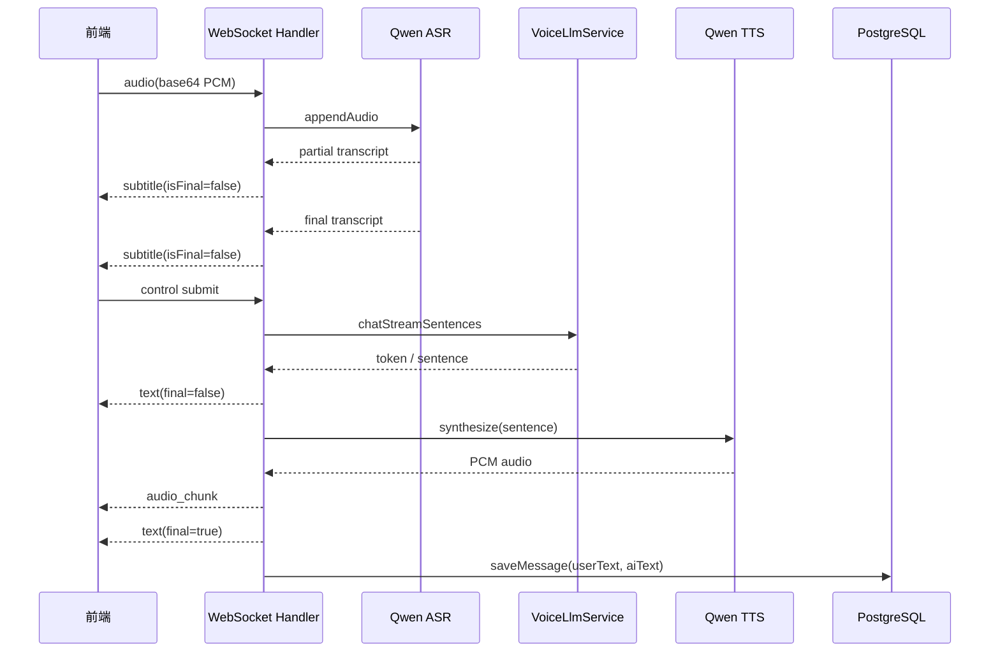
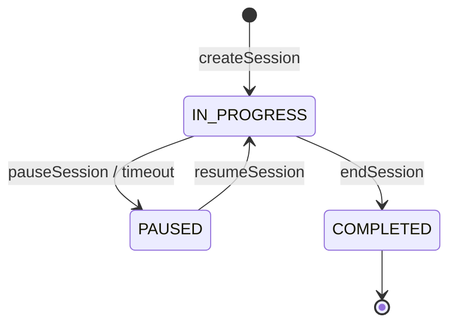

# 语音面试架构说明

本文档描述 `modules/voiceinterview` 语音面试模块的当前实现。模块通过 REST
接口管理会话生命周期，通过 WebSocket 承载实时语音交互，并在会话结束后异步生成
面试评估。

## 1. 模块边界

语音面试模块位于：

```text
app/src/main/java/interview/guide/modules/voiceinterview
```

核心职责：

- 创建、暂停、恢复、结束和删除语音面试会话。
- 通过 WebSocket 接收前端音频流并返回实时字幕、AI 文本和 AI 音频。
- 调用 DashScope Qwen ASR 将候选人语音转写为文本。
- 调用 LLM 生成面试官追问或反馈。
- 调用 DashScope Qwen TTS 将 AI 文本合成为语音。
- 保存问答历史，并在会话结束后异步生成评估报告。

## 2. 总体架构

```mermaid
flowchart LR
  FE[React 前端] -->|REST| Controller[VoiceInterviewController]
  FE <-->|WebSocket /ws/voice-interview/{sessionId}| WS[VoiceInterviewWebSocketHandler]

  Controller --> Service[VoiceInterviewService]
  Service --> DB[(PostgreSQL)]
  Service --> Redis[(Redisson 会话缓存)]

  WS --> ASR[QwenAsrService]
  ASR -->|final / partial transcript| WS
  WS --> LLM[VoiceLlmService]
  LLM --> AI[ChatClient / LLM Provider]
  WS --> TTS[QwenTtsService]
  TTS --> WS

  Service --> Queue[异步任务队列]
  Queue --> Consumer[VoiceEvaluateStreamConsumer]
  Consumer --> Eval[VoiceInterviewEvaluationService]
  Eval --> AI
  Eval --> DB
```

## 3. REST 接口

入口类：`VoiceInterviewController`

基础路径：

```text
/api/voice-interview
```

主要接口：

| 方法 | 路径 | 说明 |
| --- | --- | --- |
| `POST` | `/sessions` | 创建语音面试会话，返回 `sessionId` 和 WebSocket 地址 |
| `POST` | `/sessions/{sessionId}/end` | 结束会话，并触发异步评估 |
| `PUT` | `/sessions/{sessionId}/pause` | 暂停会话 |
| `PUT` | `/sessions/{sessionId}/resume` | 恢复会话 |
| `GET` | `/sessions` | 查询当前用户的会话列表，可按状态过滤 |
| `DELETE` | `/sessions/{sessionId}` | 删除会话、消息和评估数据 |
| `GET` | `/sessions/{sessionId}/messages` | 查询会话问答历史 |
| `GET` | `/sessions/{sessionId}/evaluation` | 查询评估状态或评估结果 |
| `POST` | `/sessions/{sessionId}/evaluation` | 手动触发异步评估 |

创建会话后，后端会根据当前请求上下文拼出 WebSocket 地址：

```text
ws://{host}/ws/voice-interview/{sessionId}
wss://{host}/ws/voice-interview/{sessionId}
```

## 4. WebSocket 实时链路

WebSocket 注册位置：`WebSocketConfig`

```text
/ws/voice-interview/{sessionId}
```

连接建立时，后端会：

1. 提取路径中的 `sessionId`。
2. 创建 `ConcurrentWebSocketSessionDecorator`，提高发送安全性。
3. 初始化本地 `SessionState`。
4. 启动 DashScope ASR 实时转写会话。
5. 下发 `welcome` 控制消息。
6. 如果该会话没有历史消息，则自动发送开场问题。

### 前端发送消息

音频消息：

```json
{
  "type": "audio",
  "data": "base64-encoded-pcm"
}
```

控制消息：

```json
{
  "type": "control",
  "action": "submit",
  "data": {
    "text": "候选人最终确认的回答文本"
  }
}
```

当前支持的控制动作：

| action | 说明 |
| --- | --- |
| `submit` | 提交当前回答，触发 LLM + TTS 管线 |
| `end_interview` | 结束会话 |
| `start_phase` | 切换面试阶段 |

### 后端下发消息

控制消息：

```json
{
  "type": "control",
  "action": "welcome",
  "message": "连接成功，准备开始语音面试",
  "timestamp": 1710000000000
}
```

字幕消息：

```json
{
  "type": "subtitle",
  "text": "实时识别文本",
  "isFinal": false
}
```

AI 文本消息：

```json
{
  "type": "text",
  "content": "AI 面试官回复",
  "final": true
}
```

完整音频消息：

```json
{
  "type": "audio",
  "data": "base64-encoded-wav",
  "text": "对应的 AI 文本"
}
```

分块音频消息：

```json
{
  "type": "audio_chunk",
  "data": "base64-encoded-wav",
  "index": 0,
  "isLast": false
}
```

分块音频结束后会发送：

```json
{
  "type": "control",
  "action": "audio_complete"
}
```

## 5. 实时处理流程

单轮问答处理流程：



实现要点：

- ASR 的 partial 结果只用于实时字幕。
- ASR 的 final 结果会先进入 `SessionState.mergeBuffer`。
- 前端发送 `submit` 后，后端才把合并后的用户回答提交给 LLM。
- LLM 支持流式文本输出，按句子触发 TTS，降低首段语音等待时间。
- TTS 返回 PCM 后，后端会包装为 WAV 再通过 WebSocket 下发，方便浏览器播放。
- `aiSpeaking` 和冷却时间用于减少 AI 播放尾音被麦克风重新识别的问题。

## 6. 会话生命周期

会话实体：`VoiceInterviewSessionEntity`

核心状态：

| 字段 | 说明 |
| --- | --- |
| `status` | 会话状态，来自 `VoiceInterviewSessionStatus` |
| `currentPhase` | 当前面试阶段：`INTRO`、`TECH`、`PROJECT`、`HR`、`COMPLETED` |
| `evaluateStatus` | 异步评估状态，来自 `AsyncTaskStatus` |
| `evaluateError` | 异步评估失败原因 |

生命周期：



阶段流转由 `VoiceInterviewService#getNextPhase` 控制，按启用情况依次进入：

```text
INTRO -> TECH -> PROJECT -> HR -> COMPLETED
```

阶段切换判断会参考 `app.voice-interview.phase` 中的时长和题量配置。

## 7. 数据持久化

主要表：

| Entity | 表名 | 说明 |
| --- | --- | --- |
| `VoiceInterviewSessionEntity` | `voice_interview_sessions` | 会话基本信息、阶段、状态、评估状态 |
| `VoiceInterviewMessageEntity` | `voice_interview_messages` | 每轮候选人回答和 AI 问题 |
| `VoiceInterviewEvaluationEntity` | `voice_interview_evaluations` | 总分、反馈、单题评价、参考答案 JSON |

消息保存策略：

- 开场问题会先保存 AI 文本，再推送给前端。
- 用户提交回答后，如果上一条 AI 问题尚未绑定回答，会回填到上一条消息。
- 新的 AI 回复会作为新消息保存，并带上递增的 `sequenceNum`。

会话缓存：

```text
voice:interview:session:{sessionId}
```

当前使用 Redisson `RBucket` 缓存会话实体，默认 TTL 为 1 小时。

## 8. 异步评估

会话结束时：

1. `VoiceInterviewService#endSession` 将会话置为 `COMPLETED`。
2. 将 `evaluateStatus` 置为 `PENDING`。
3. 事务提交后投递评估任务。

评估任务链路：

```text
VoiceEvaluateStreamProducer
  -> AsyncTaskStreamConstants.VOICE_EVALUATE_STREAM_KEY
  -> VoiceEvaluateStreamConsumer
  -> VoiceInterviewEvaluationService#generateEvaluation
```

说明：

- 当前代码通过 `RabbitMqTaskQueueService` 承载异步任务，常量名称仍沿用 stream 命名。
- Consumer 会把状态从 `PENDING` 更新为 `PROCESSING`。
- 评估成功后写入 `voice_interview_evaluations`，状态更新为 `COMPLETED`。
- 失败后状态更新为 `FAILED`，错误信息写入 `evaluateError`。
- 评估逻辑复用 `UnifiedEvaluationService`，并结合技能库参考内容生成结构化结果。

## 9. 配置项

配置入口：`VoiceInterviewProperties`

前缀：

```yaml
app:
  voice-interview:
```

关键配置：

| 配置 | 说明 |
| --- | --- |
| `opening-audio-warmup-enabled` | 是否预热开场白音频缓存 |
| `llm-streaming-enabled` | 是否启用 LLM 流式文本下发 |
| `chunked-audio-enabled` | 是否启用按句 TTS 分块音频下发 |
| `ai-question-max-chars` | 单轮 AI 回复最大字符数 |
| `tts-timeout-seconds` | 单句 TTS 超时时间 |
| `max-concurrent-tts-per-session` | 单会话并发 TTS 上限 |
| `phase.*` | 各阶段时长和题量边界 |
| `qwen.asr.*` | DashScope 实时 ASR 配置 |
| `qwen.tts.*` | DashScope 实时 TTS 配置 |

运行时还会通过 `AiSettingsResolver` 支持按用户覆盖 ASR/TTS 配置。

## 10. 定时清理与容错

`VoiceInterviewWebSocketHandler` 中有两个定时任务：

- 每 30 秒检查活动时间，超过阈值后发送暂停提醒或自动暂停会话。
- 每 5 分钟清理长时间停留在 `IN_PROGRESS` 的会话，以及卡住的评估任务。

连接容错：

- ASR 未就绪时会延迟检查并重试。
- ASR 连接断开或 append 失败时会尝试重启转写会话。
- WebSocket 断开后会停止 ASR，并自动结束仍处于进行中的会话。
- LLM 或 TTS 失败时会向前端发送用户可见错误消息。

## 11. 相关类速查

| 类 | 职责 |
| --- | --- |
| `VoiceInterviewController` | REST API 入口 |
| `WebSocketConfig` | 注册语音面试 WebSocket 路径和握手拦截器 |
| `VoiceInterviewWebSocketHandler` | 实时音频、字幕、LLM、TTS 管线编排 |
| `VoiceInterviewService` | 会话生命周期、消息保存、缓存和评估任务触发 |
| `QwenAsrService` | DashScope Qwen 实时 ASR 封装 |
| `VoiceLlmService` | 语音面试 LLM Prompt 构造和流式调用 |
| `QwenTtsService` | DashScope Qwen 实时 TTS 封装 |
| `VoiceInterviewEvaluationService` | 语音面试评估生成和 DTO 构造 |
| `VoiceEvaluateStreamProducer` | 投递语音面试评估任务 |
| `VoiceEvaluateStreamConsumer` | 消费评估任务并更新状态 |
